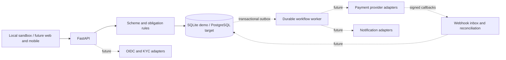

# Architecture decision: FastAPI modular monolith

## Stack decision

Use FastAPI and Python. The user prefers it, and this domain does not require a Node.js backend. Python provides a direct path to ML libraries for later risk triage, document extraction orchestration, and anomaly analysis. FastAPI itself is an API framework, not an ML engine. CPU-intensive inference/training should run in separate workers so it does not block API traffic or duplicate large models across API processes.

FastAPI documents [worker processes and their deployment implications](https://fastapi.tiangolo.com/deployment/server-workers/). SQLAlchemy supports explicit [transaction boundaries](https://docs.sqlalchemy.org/en/20/orm/session_basics.html), used here for atomic state/ledger writes.

Node/NestJS would be reasonable for an all-TypeScript team, but shared frontend language is not a sufficient reason to override this preference. A future Next.js frontend can consume generated OpenAPI types. The local HTML/JavaScript sandbox keeps this bootstrap runnable with one process and no frontend build system.

## Boundaries

Solid edges exist in the bootstrap. Dotted edges are planned, not running integrations.

Start with a modular monolith; extract Auth/Identity, Scheme, Contract, Ledger, Payment, Trust, Notification, Dispute and Admin modules as those slices are implemented. Current domain math and persistence are isolated; route orchestration is deliberately kept together until those additional behaviors exist.

Use PostgreSQL as the production source of truth. SQLite provides a zero-service local demo. The demo serializes its requests with a write transaction; PostgreSQL configuration uses a coarse advisory transaction lock. This is correct for bootstrap serialization but limits throughput; replace it with ordered user/scheme row locks plus unique business keys and concurrency tests before production. The optional PostgreSQL path has not been exercised locally.

Use SQL marketplace filtering initially. Redis and OpenSearch can be introduced when real rate-limiting/session/search requirements justify them. Durable scheduling is necessary for financial work; naive in-process background tasks are not a durable payment queue. Choose Temporal or a managed queue with explicit workflow state in the provider-integration milestone.

## Financial invariants

- Each period's contribution allocation sums exactly to the payout target.
- Across M periods, each member contributes T and receives T once.
- Membership, order, currency and all installment allocations are frozen in the signed proposal hash.
- Activation requires every finalized member's assent.
- Natural settlement identity is `(scheme, period)`; ledger rows have a unique `(scheme, period, user, direction)` key.
- Ledger mutations and period advancement commit together.
- No payout proceeds unless the synthetic settled pool covers it.
- Net position is contributed minus collected; remaining obligation is total contracted contributions minus contributed. These are distinct values.

The simplified ledger is an obligation subledger. Production custody/accounting requires balancing cash, clearing, receivable, payable, reserve and fee accounts with an append-only double-entry model and independent reconciliation; this bootstrap does not claim to implement those controls.

## ML boundary

Keep settlement, contribution amounts, eligibility enforcement and accounting deterministic. Future model results should be versioned advisory risk signals with evidence and review, not unchecked authority to move money or penalize members. Do not ingest raw identity documents into a general model by default; provider selection and data handling requirements precede that work.
